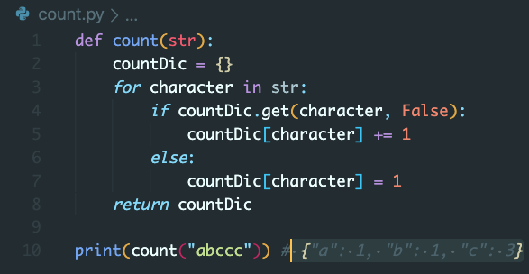

Friyay3
-

---

Warm Up Problem
--

Work individually and come back at 9:15 for us to go over it.

Write a function called **count** that accepts a string and returns a dictionary containing the counts of each character in the string. count('abccc') should return {"a": 1, "b": 1, "c": 3}.

---

___

Big O Notation
--

---

What is Big O and why do we need it?
--

___

Big O is the language we use for talking about how long an algorithm takes to run.

We use this notation because these problems have lots of solutions, and we need a way of knowing if one is better than another. We judge this based on speed.

---

Computers all have different speeds and runtimes. So instead, we want to count how good an algorithm is in terms of steps.

---

