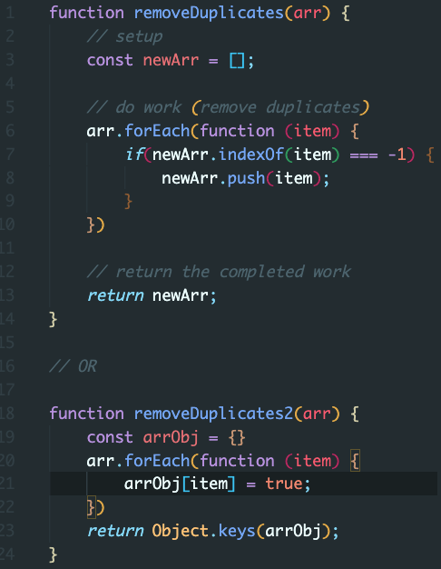
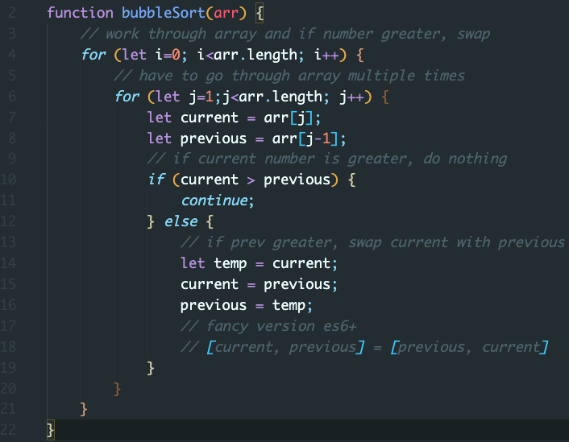
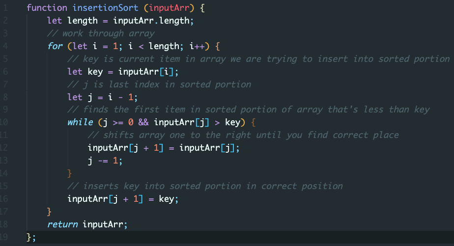
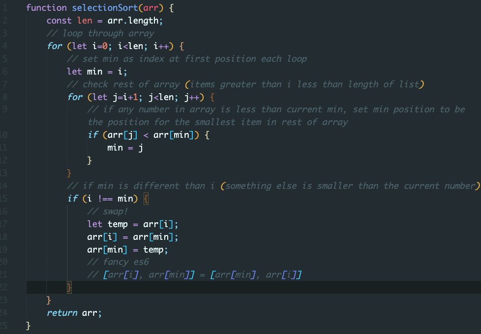

Friyay4
--

---

Warm Up Problem
--

Work individually, and we'll come back at 9:20.

Write a function called **removeDuplicates** that given an array of items, returns the array without any duplicates. So, removeDuplicates([1, 2, 3, 4, 4, 4, 5, 6, 6, 7]) should return [1, 2, 3, 4, 5, 6, 7].

---

---

Group whiteboarding
--

---

Write a function called **sort** that given an array of numbers, returns a sorted array. So sort([10, 5, 9, 4, 17]) should return [4, 5, 9, 10, 17].

---

Sorting!
--

---

BubbleSort
--

---

InsertionSort

---

SelectionSort

---

What's the O(?) for these sorting methods?
--

---

O(n^2)
--

---
Examples:
--

https://visualgo.net/bn/sorting
https://www.toptal.com/developers/sorting-algorithms

---

Links:
--
- Bubble Sort:
https://dev.to/ryan_dunton/bubble-sorting-for-beginners-in-js-2opp

- Insertion Sort:
https://dev.to/ryan_dunton/insertion-sorting-for-beginners-in-js------fkg

- Selection Sort: 
https://medium.com/javascript-algorithms/javascript-algorithms-selection-sort-54da919d0513

