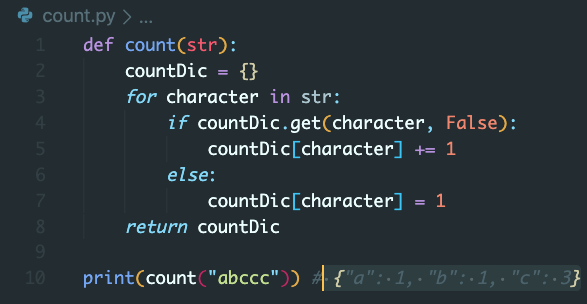
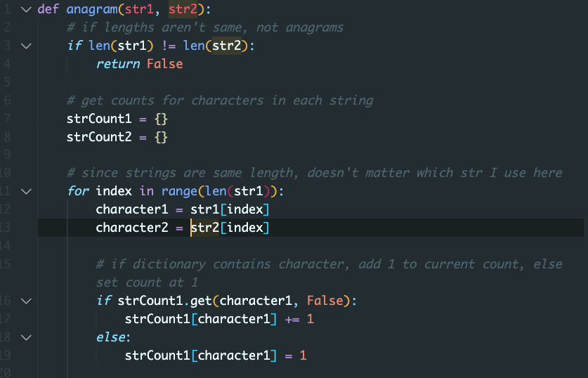
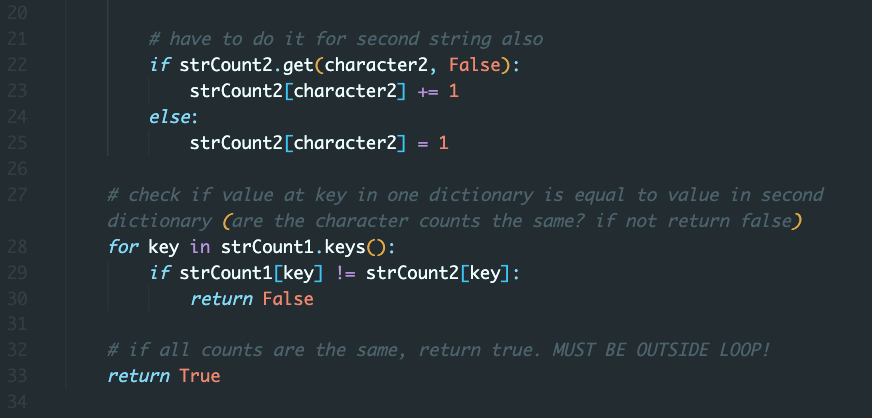
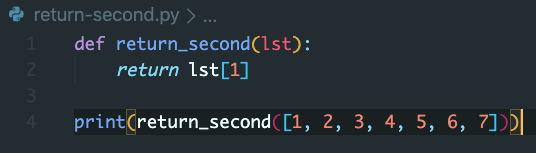
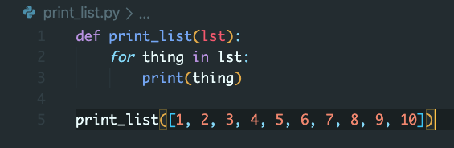
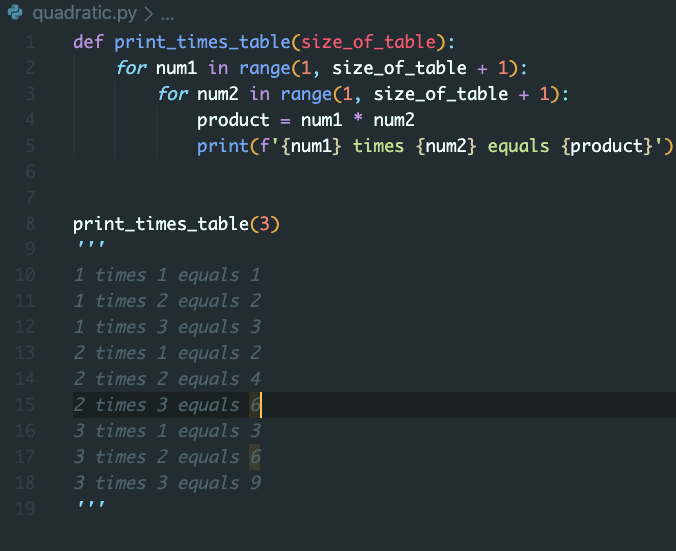
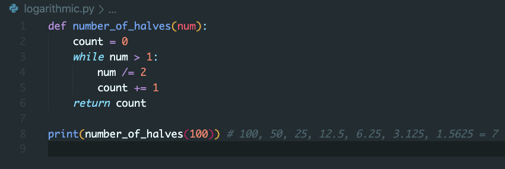
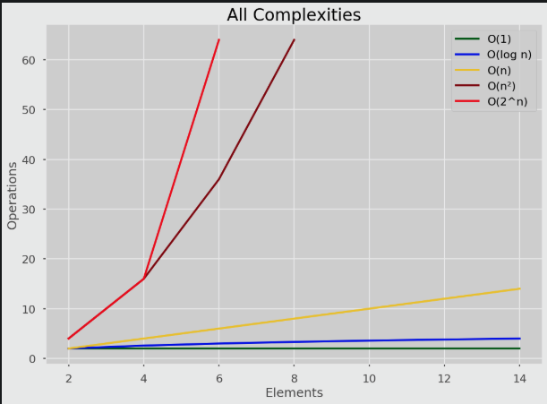

Friyay3
-

---

Warm Up Problem
--

Work individually and come back at 9:15 for us to go over it. You can use Visual Studio Code (not whiteboard practice).

Write a function called **count** that accepts a string and returns a dictionary containing the counts of each character in the string. count('abccc') should return {"a": 1, "b": 1, "c": 3}.

---

___

Write a function called **anagram** that accepts two strings and return True if they are anagrams and False if they aren't. anagram('listen', 'silent') should return True. anagram('cat', 'axe') should return False.

___
Part 1: Solution

___
Part 2: Solution

---

Big O Notation
--

---

What is Big O and why do we need it?
--

___

Big O is the language we use for talking about how long an algorithm takes to run (or how much space it takes up).

We use this notation because these problems have lots of solutions, and we need a way of knowing if one is better than another. We judge this based on speed (and sometimes space).

---
Calculating Speed of Algorithms:
--

https://rithmschool.github.io/function-timer-demo/

---

Computers all have different speeds and runtimes. So instead, we want to count how good an algorithm is in terms of steps. To show speed, let's look at some examples:

---

O(1 or constant)
--

---

O(n or linear)
--

---

O(n^2 or quadratic)
--

---

O(log(n) or logarithmic)
--

---

O(2^(n) or exponential)
--

It's like trying to guess a password. If a password is 10 characters long, and you have 62 possible characters(A-Z, a-z, 0-9) to choose from, then to find how many tries it would take, it's 62^10 ... aka a really, really big number. Very rarely will you encounter an exponential BigO function

---
Comparing Big O:
--

---
Extra Resources:
--

https://skerritt.blog/big-o/
https://towardsdatascience.com/understanding-time-complexity-with-python-examples-2bda6e8158a7